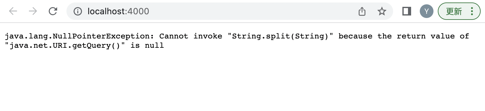
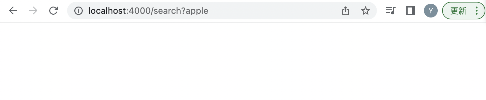

## Part 1: Search Engine

My code for SearchEngine.java is the following:

 ```
import java.util.Arrays;
import java.io.IOException;
import java.net.URI;

class Handler implements URLHandler {
    int num = 0;

    public String handleRequest(URI url) {
        String[] strs = {};
        String[] newarr = {};
        String[] parameters = url.getQuery().split("=");
        if (url.getPath().equals("/add")) {
            if (parameters[0].equals("?s") & Arrays.asList(strs).contains(parameters[1])) {
                newarr = new String[strs.length + 1];
                for (int i=0; i<strs.length; i++) {
                    newarr[i] = strs[i]; 
                }
                newarr[strs.length] = parameters[1];
                strs = newarr.clone();
            }
            return null;
        } else {   
            if (url.getPath().equals("/search")) {
                String target = "";
                String newtarget = "";
                for (String str: strs) {
                    if (str.contains(parameters[1])) {
                        newtarget = target + " and " + str;
                        target = newtarget;
                    }
                }
                return target;
            }
            return null;
        }
    }
}

class SearchEngine {
    public static void main(String[] args) throws IOException {
        if(args.length == 0){
            System.out.println("Missing port number! Try any number between 1024 to 49151");
            return;
        }

        int port = Integer.parseInt(args[0]);

        Server.start(port, new Handler());
    }
}
 ```

I am using the main method to create the website. I enter 4000 in the terminal when creating the website by command `javac SearchEngine.java; java SearchEngine 4000`. The website shows an error of nullPointerException as the result.


I am using the handleRequest method which has the adding part in it. I directly add "/add?s=apple" to the url to achieve this instead of writing commands in terminal. I update the variable strs which stores all the added values to be website in it.



