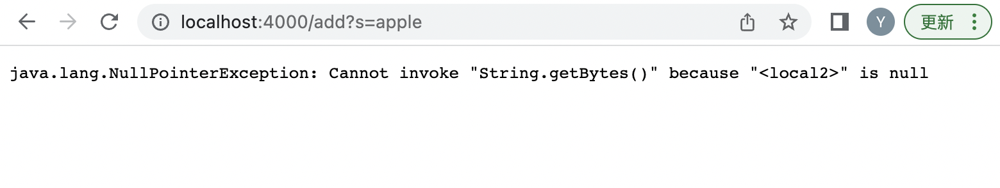

## Part 1: Search Engine

My code for SearchEngine.java is the following:

 ```
import java.util.Arrays;
import java.io.IOException;
import java.net.URI;

class Handler implements URLHandler {
    int num = 0;

    public String handleRequest(URI url) {
        String[] strs = {};
        String[] newarr = {};
        String[] parameters = url.getQuery().split("=");
        if (url.getPath().equals("/add")) {
            if (parameters[0].equals("?s") & Arrays.asList(strs).contains(parameters[1])) {
                newarr = new String[strs.length + 1];
                for (int i=0; i<strs.length; i++) {
                    newarr[i] = strs[i]; 
                }
                newarr[strs.length] = parameters[1];
                strs = newarr.clone();
            }
            return null;
        } else {   
            if (url.getPath().equals("/search")) {
                String target = "";
                String newtarget = "";
                for (String str: strs) {
                    if (str.contains(parameters[1])) {
                        newtarget = target + " and " + str;
                        target = newtarget;
                    }
                }
                return target;
            }
            return null;
        }
    }
}

class SearchEngine {
    public static void main(String[] args) throws IOException {
        if(args.length == 0){
            System.out.println("Missing port number! Try any number between 1024 to 49151");
            return;
        }

        int port = Integer.parseInt(args[0]);

        Server.start(port, new Handler());
    }
}
 ```

I am using the main method to create the website. I enter 4000 in the terminal when creating the website by command `javac SearchEngine.java; java SearchEngine 4000`. The website shows an error of nullPointerException as the result which I don't know why.


I am using the handleRequest method which has the adding part in it. I directly add "/add?s=apple" to the url to achieve this instead of writing commands in terminal. I update the variable strs which stores all the added values to be website in it. The website shows an error and I still don't have any thoughts about why it happens.


I am using the handleRequest method which has the searching part in it. Since there is no target string in the strs array, it only returns a empty string so nothing appears on the website.


## Part 2: Debug

For averageWithoutLowest method in the ArrayExamples file which has codes like this:
```
static double averageWithoutLowest(double[] arr) {
    if(arr.length < 2) { return 0.0; }
    double lowest = arr[0];
    for(double num: arr) {
      if(num < lowest) { lowest = num; }
    }
    double sum = 0;

    for(double num: arr) {
        if(num != lowest) { sum += num;}
    }
    return sum / (arr.length - 1);
  }
 ```
 
I write the test which is the failure inducing input as:
```
@Test
  public void testAverage2() {
    double[] input1 = {1.0, 1.0, 1.0, 1.0};
    assertEquals(1.0, ArrayExamples.averageWithoutLowest(input1), 0.001);
  }
```

 And the syptom which is the result of test is:
 


The bug of the method is `if(num != lowest) { sum += num;}`. It only adds those number which are not equal to the lowest one into the sum but when there are multiple numbers with the same lowest value, it is only expected to delete one of them instead of all. So when the given array is composed by multiple same numbers, it will not count any of them into the sum and return 0 as the mean while it should only remove one number and return the value of the mean of numbers which is 1.


The second test is for filter method in ListExamples file which has codes like this:
```
static List<String> filter(List<String> list, StringChecker sc) {
    List<String> result = new ArrayList<>();
    for(String s: list) {
      if(sc.checkString(s)) {
        result.add(0, s);
      }
    }
    return result;
  }
```

I write a test and a StringChecker method to test it:
```
@Test
  public void testFilter() {
    List<String> original = new ArrayList<>();
    original.add("1234");
    original.add("acbd");
    original.add("678");
    List<String> expected = new ArrayList<>();
    expected.add("1234");
    expected.add("acbd");
    assertEquals(expected, ListExamples.filter(original, new filter()));
  }
  
class filter implements StringChecker {
  public boolean checkString(String var1) {
    return (var1.length() > 3);
  }
}
```

 And the syptom which is the result of test is:
 
 
 
 The bug of the method is `result.add(0, s);` It add astring every time at index 0 which inverse the order of the original List while we expected the order to be the same.
